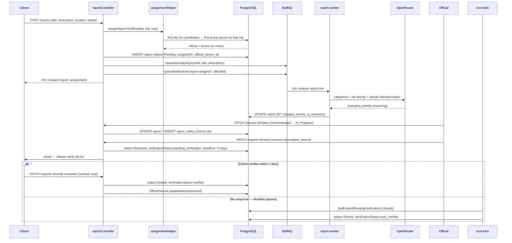
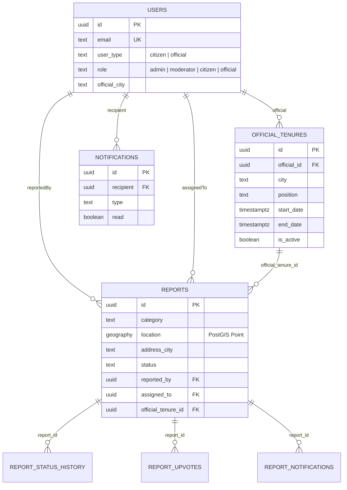

# CivicTrack — Architecture

A companion to `README.md` (what it does) and `MIGRATION.md` (why the
database looks the way it does). This doc is about **how the pieces
fit together** — read this before diving into individual files.

## System overview

```mermaid
flowchart LR
    subgraph Client
        FE[Next.js Frontend]
    end

    subgraph Backend[Express Backend]
        API[REST API<br/>controllers → services → models]
        WS[SSE streams]
        Q[BullMQ Queue]
        W[Workers:<br/>AI analysis, notifications]
        CRON[node-cron:<br/>reminders, auto-verify, TTL purge]
    end

    subgraph Data
        PG[(PostgreSQL + PostGIS<br/>users · reports · tenures · notifications)]
        MONGO[(MongoDB<br/>GridFS: video files only)]
        REDIS[(Redis<br/>queue + pub/sub)]
        CLOUD[Cloudinary<br/>images]
    end

    subgraph External
        AI[OpenRouter LLM<br/>report categorization]
        SMTP[Email — Nodemailer]
    end

    FE <-->|HTTPS + JWT| API
    FE <-->|SSE (server push)| WS
    API --> PG
    API -->|videos ≥10MB| MONGO
    API -->|images| CLOUD
    API -->|enqueue job| Q
    Q --> REDIS
    W --> REDIS
    W --> AI
    W --> PG
    W --> WS
    CRON --> PG
    CRON --> SMTP
    API --> SMTP
```

## Request flow: creating and resolving a report

This is the flow worth tracing file-by-file first — it touches almost
every layer of the app.



## Data model



## Layers, top to bottom

| Layer | Location | Responsibility |
|---|---|---|
| Routes | `backend/routes/` | URL → controller mapping, auth/role middleware |
| Controllers | `backend/controllers/` | Parse request, call services/models, shape response |
| Services | `backend/services/` | Multi-step business logic that spans >1 model (tenure overlap checks, scorecards, notification fan-out) |
| Models | `backend/models/` | Raw parameterized SQL, one file per table, returns plain JS objects |
| DB | `backend/db/` | Connection pool + schema |

Controllers stay thin: `req` in, call one or two service/model
functions, `res` out. If you're tracing a bug, start at the route,
then the controller, then follow the model/service calls — the naming
is 1:1 with the SQL tables involved.

## Background jobs (`workers/`, `queues/`)

- **`report.queue.js`** enqueues two job types: AI analysis (new report
  text → category/priority) and notifications (assignment, status
  changes).
- **`report.worker.js`** consumes AI-analysis jobs via BullMQ, calls
  `services/aiService.js` (OpenRouter), writes the result back.
- **`notification.worker.js`** consumes notification jobs, calls
  `services/notificationService.js` (in-app + email + SSE push).
- Both run **out-of-process from the request** — a slow AI call never
  blocks the citizen's "report created" response.

## Scheduled jobs (`utils/cronJobs.js`)

- **Hourly**: send verification reminders for reports awaiting citizen
  confirmation; auto-verify any past their 2-day deadline.
- **Nightly**: purge notifications older than 30 days (replaces
  MongoDB's TTL index — see `MIGRATION.md`).

## Real-time (`services/sseService.js`)

Real-time push uses Server-Sent Events, not WebSockets — everything
here is server → client only (notifications, live report updates), so
a plain one-way HTTP stream is a better fit than a full-duplex socket.
`GET /notifications/stream` gives each logged-in user a personal event
stream (report assigned, status changed, AI analysis completed,
resolution requested/verified); `GET /reports/:id/stream` gives anyone
viewing a report's detail page live status/upvote updates. Both are
plain `EventSource` connections on the frontend — no socket library.
`notificationService` pushes to them via `sseService.sendToUser` /
`sendToReport` / `broadcastToRole`, keeping the same method names the
old Socket.IO version used so nothing else had to change. Auth travels
as a `?token=` query param (`EventSource` can't set headers), verified
by `middleware/sseAuth.js`.

## Auth & authorization

- `middleware/auth.js` — verifies the JWT, loads `req.user` from
  Postgres.
- `middleware/authorize.js` — role gate (`admin`, `official`,
  `citizen`) used per-route.
- Three roles, three dashboards on the frontend: citizen (report/track),
  official (assigned queue + scorecard), admin (tenure management +
  system-wide analytics).

## Storage split

- **Cloudinary** — images (small, need CDN + transforms).
- **MongoDB GridFS** — videos ≥10MB (Cloudinary's free tier doesn't fit
  large video; GridFS streams chunks instead of holding a whole file
  in memory). This is the one piece intentionally left outside
  Postgres — see `MIGRATION.md` for why.

## Where geography actually happens

`utils/assignmentHelper.js` is the one function worth reading closely:
given a report's lat/lng, it reverse-geocodes to a city, then queries
`official_tenures` for whichever official's tenure covers that city
*and* is active *right now* — so a report always routes to whoever is
currently responsible, even as officials rotate through tenures over
time.
